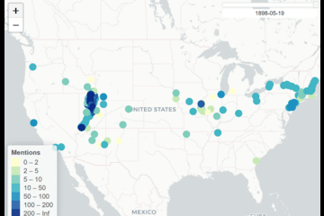
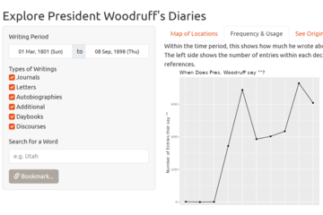
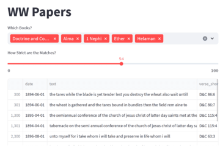

## OUR MISSION
Our mission, by 2027, is to digitally preserve and publish Wilford Woodruff’s eyewitness account of the Restoration of the Gospel of Jesus Christ from 1833 to 1898.
Our purpose in making Wilford Woodruff’s faithful records universally accessible is to inspire all people, especially the rising generation, to study and increase their faith in Jesus Christ, understand and honor sacred temple covenants, and thereby receive the blessings of exaltation with their families.

Brigham Young University - Idaho's Data Science Program and The Research and Business Development Center in partnership with The Wilford Woodruff Papers project are on a journey to incorporate the tools of data science into the editorial process of bringing the writings of Wilford Woodruff out of obscurity. We leverage our Data Science Society, Senior Projects, and Data Science Consulting Class to meet this goal.

### What have Others Made?

<table>
  <tr>
    <td>
    <a href="https://wilfordwoodruff.github.io/app_map/index.html">
     Here's a map Clara Broberg made for her Senior Project.</a>
    </td>
    <td>
      <a href="https://dr-iggs.shinyapps.io/Wilford-Woodruff-Exploration/">
     Here's our sample web app, which can help you find ideas.</a></td>
    <td>
      <a href="https://woodruffquery.streamlit.app/">
     Here's an App that finds scripture quotes in his writings.</a>
    </td>
  </tr>
</table>

<!-- When the R Shiny works we can theoretically embed it directly into this website if we want.-->

## Where do I Start?

Don't worry too much about trying to build something, just start messing around and look for something interesting. You can check out [this link](https://dr-iggs.shinyapps.io/Wilford-Woodruff-Exploration/) to explore the archive of journals and letters. As you look at what he shares, maybe an idea will come to you!

### I Have an Idea, How Can I Build It?
Start [here](https://wilfordwoodruff.github.io/Public_Stories/)!
